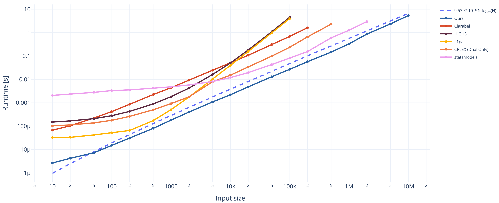
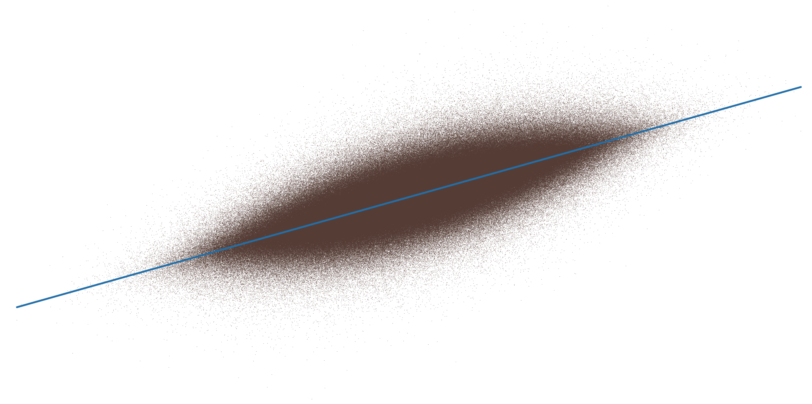

# `palb` and `palb-py`
PALB is an exact, robust, high-performance solver for the Least-Absolute-Deviations-Line (LAD) problem, i.e. one dimensional affine linear L1 regression.
The core (`palb`) is implemented in Rust, but it also comes with a Python API (`palb_py`).

## The LAD Problem

Let $(x_i, y_i), i=1,...,N$ be points in the plane $\mathbb{R}^2$.
The associated LAD problem seeks to determine a slope $m$ and intercept $t$ that solve the problem

$$
\min_{m,t \in \mathbb{R}} f(m,t), \quad \text{with } f(m,t) = \sum_{i=1}^N |mx_i + t - y_i|.
$$

Least-absolute-deviations (LAD) line fitting is robust to outliers but computationally more involved than least squares regression. Although the literature includes linear and near-linear time algorithms for the LAD line fitting problem, these methods are difficult to implement and, to our knowledge, lack maintained public implementations. As a result, practitioners often resort to linear programming (LP) based methods such as the simplex-based Barrodale-Roberts method and interior-point methods, or on iteratively reweighted least squares (IRLS) approximation which does not guarantee exact solutions.

## PALB

Piecewise Affine Lower-Bounding (PALB) aims to close this gap by being an exact algorithm that is comparatively simple to implement and scales very well in practice.
It guarantees termination with an exact solution in a finite number of steps (for bounds on the number of steps please see the associated paper.
PALB comes with both deterministic and probabilistic bounds, as well as bounds in terms of the quality of an initial guess), and we empirically found that PALB scales log-linearly on both synthetic and real data in practice.
It is consistently faster than publicly available implementations of LP based and IRLS based solvers.

Moreover PALB is relatively straightforward to implement and sports a simple, static memory profile.
This may make it an interesting choice for embedded applications.

## Performance profiles

A performance profile (associated with a set of methods and test problems) measures how well each algorithm in the group performs relative to the best algorithm in the group on a per-problem basis. More concretely, the value $\rho_s(\tau)$ of a performance profile $\rho_s : \mathbb{R}_{\geq 1} \to [0,1]$ for solver $s \in \mathcal{S}$ gives the probability that a *score* (runtime or objective value) of method $s$ is within a factor $\tau$ of the best score among all methods in $\mathcal{S}$ on a uniformly randomly chosen problem from the given test problem group.
 
We created performance profiles comparing PALB with a variety of state-of-the-art methods on synthetic as well as real data.
The real data is from the NOAA's Integrated Surface Database (ISD) where the LAD problem was to regress dry-bulb-temperature on time.
The synthetic data consists of three larger subexperiments, each inteded to stress a specific aspect of solver performance. 
For details please see the associated paper.

* [Performance profile for the produced objective function value on real data](./img/perfprof_obj_real.pdf)
* [Performance profile for the produced objective function value on synthetic data](./img/perfprof_obj_synthetic.pdf)
* [Performance profile for the runtime on real data](./img/perfprof_time_real.pdf)
* [Performance profile for the runtime on synthetic data](./img/perfprof_time_synthetic.pdf)

## Preprint

There is no published preprint yet.

## Documentation

* The **API docs** for the Rust API (`palb`) are available at [docs.rs](https://docs.rs/palb).
* The associated Rust crate is published at [crates.io](https://crates.io/crates/palb).
* The Python module is published on [PyPI](https://pypi.org/project/palb-py/).

## Citing

If you find PALB useful in your work please cite the associated paper as:
```bibtex
@article{
    ... TBD
}
```

## Some images

This figure shows the median runtime of the various methods across our full synthetic dataset (some methods did not converge on some of the data so their mean would not be well defined). Note the logarithmic scale on both axes.
The indicated log-linear trendline is fitted using least-squares regression on the runtimes of our method.



This image shows an L1 line fitted using PALB to a large data sample containing multiple million points.


